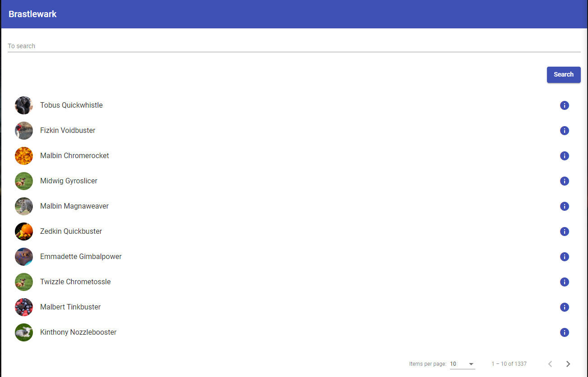

# Brastlewark

With this application you can search gnomes of Brastlewark, see their information and browse trough their friends.

Uses Angular 9 ([visit here](https://angular.io/)) as the development framework and Angular Material ([visit here](https://material.angular.io/)) for the look and feel.

Gnomes list (desktop view)

Gnome info (mobile view)

## Execution of the app

The first step is cloning this respository, with the instruction:

~~~
git clone https://github.com/theguitxo/brastlewark-a9.git
~~~

Then enter in the folder of the app

~~~
cd brastlewark-a9
~~~

Launch the development server with

~~~
ng serve
~~~

And finally, open the browser and navigate to

~~~
https://localhost:4200
~~~

## Demo

You can see a demo in this URL

[Demo](http://brastlewark.guitxo.com)
